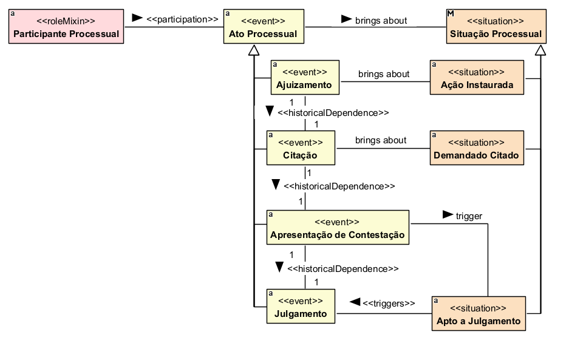

## Diagrama de procedimentos

  
### Dicionário de termos

| Conceito | Definição |
|---|---|
| **Participante Processual** | Sujeito que participa do processo exercendo determinado papel processual. |
| **Ato Processual** | Evento praticado no curso do processo que produz efeitos ou altera sua situação processual. |
| **Situação Processual** | Estado em que o processo se encontra em determinado momento de sua tramitação. |
| **Ajuizamento** | Ato processual pelo qual a demanda é apresentada ao Poder Judiciário, dando início à tramitação judicial. |
| **Ação Instaurada** | Situação processual resultante do ajuizamento da demanda perante o Poder Judiciário. |
| **Citação** | Ato processual pelo qual o demandado é formalmente chamado a participar do processo e exercer sua defesa. |
| **Demandado Citado** | Situação processual em que o demandado já foi formalmente citado para integrar o processo. |
| **Apresentação de Contestação** | Ato processual pelo qual o demandado apresenta sua defesa em relação à pretensão formulada contra ele. |
| **Apto a Julgamento** | Situação processual em que o processo reúne as condições necessárias para ser submetido a julgamento. |
| **Julgamento** | Ato processual em que a controvérsia é apreciada e decidida pelo órgão julgador. |