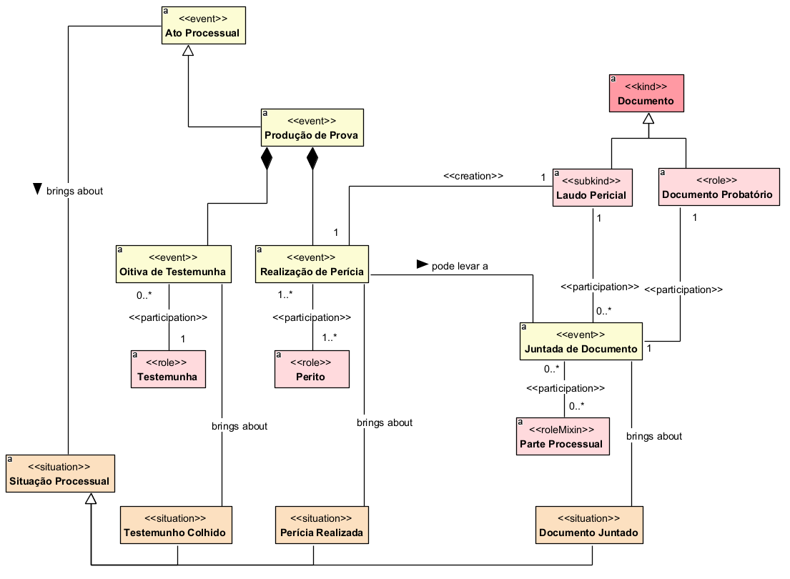

## Diagrama de Produção de Prova

  
### Dicionário de termos

| Conceito | Definição |
|---|---|
| **Ato Processual** | Evento praticado no curso do processo que produz efeitos ou altera uma situação processual. |
| **Produção de Prova** | Ato processual destinado à obtenção e incorporação de elementos probatórios necessários à demonstração dos fatos relevantes para o julgamento. |
| **Oitiva de Testemunha** | Evento de produção de prova em que é colhido o depoimento de uma testemunha sobre fatos relevantes para o processo. |
| **Testemunha** | Pessoa que participa da produção probatória prestando depoimento sobre fatos de que tenha conhecimento. |
| **Realização de Perícia** | Evento de produção de prova destinado à análise técnica ou científica de questão relevante para o processo. |
| **Perito** | Profissional responsável pela realização da perícia e pela apresentação de conhecimento técnico ou científico necessário à análise da questão examinada. |
| **Documento** | Registro que contém informações, manifestações ou comprovações juridicamente relevantes para o processo. |
| **Laudo Pericial** | Documento produzido em decorrência da realização da perícia que registra as análises, conclusões e respostas técnicas do perito. |
| **Documento Probatório** | Documento utilizado no processo como meio de demonstração de fatos relevantes à controvérsia. |
| **Juntada de Documento** | Ato processual pelo qual um documento é incorporado aos autos para fins de instrução ou comprovação. |
| **Parte Processual** | Participante que ocupa um dos polos da relação processual e pode promover a juntada de documentos no processo. |
| **Situação Processual** | Estado resultante de atos praticados durante a tramitação do processo. |
| **Testemunho Colhido** | Situação processual resultante da realização da oitiva de testemunha. |
| **Perícia Realizada** | Situação processual resultante da conclusão da realização de perícia. |
| **Documento Juntado** | Situação processual em que determinado documento foi formalmente incorporado aos autos. |