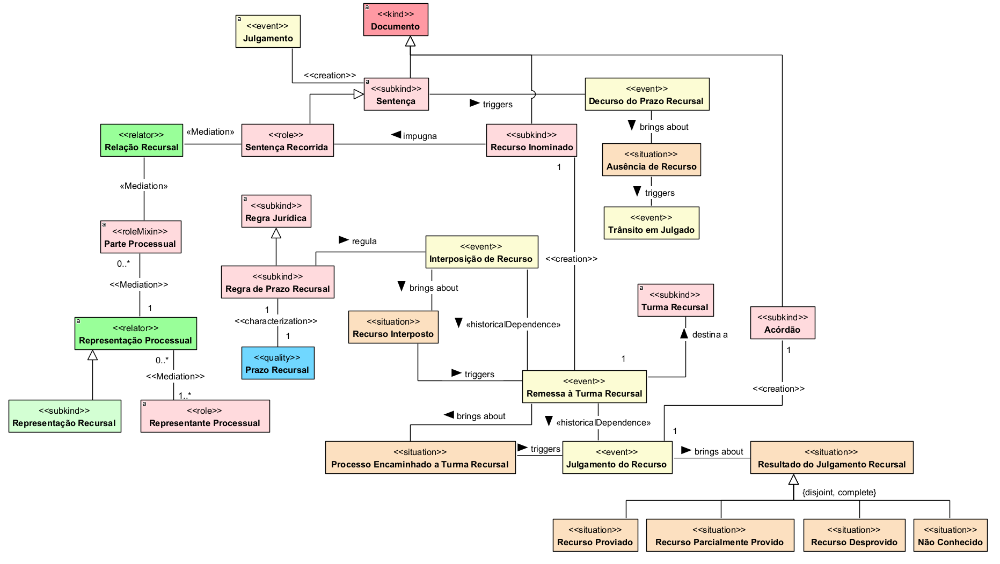

## Diagrama de recursos

  
### Dicionário de termos

| Conceito | Definição |
|---|---|
| **Documento** | Registro que contém informações, manifestações ou decisões juridicamente relevantes para o processo. |
| **Sentença** | Documento que formaliza a decisão proferida pelo juízo após o julgamento da causa. |
| **Julgamento** | Evento processual no qual a controvérsia é apreciada e decidida pelo órgão julgador. |
| **Sentença Recorrida** | Papel assumido pela sentença quando ela é objeto de impugnação por meio de recurso. |
| **Recurso Inominado** | Documento recursal utilizado para impugnar sentença proferida no âmbito do Juizado Especial Federal. |
| **Relação Recursal** | Relação constituída entre a parte recorrente e a sentença recorrida no contexto da impugnação da decisão. |
| **Parte Processual** | Participante que ocupa um dos polos da relação processual e pode exercer faculdades processuais, inclusive recorrer. |
| **Representação Processual** | Relação que vincula uma parte ao sujeito que atua juridicamente em seu nome ou na defesa de seus interesses. |
| **Representação Recursal** | Representação processual exercida especificamente para a prática de atos na fase recursal. |
| **Representante Processual** | Pessoa que atua juridicamente em nome ou na defesa dos interesses de uma parte no processo. |
| **Regra Jurídica** | Norma que estabelece condições, consequências ou critérios juridicamente aplicáveis. |
| **Regra de Prazo Recursal** | Regra jurídica que estabelece o período disponível para a interposição de determinado recurso. |
| **Prazo Recursal** | Intervalo temporal dentro do qual o recurso deve ser interposto para que seja considerado tempestivo. |
| **Interposição de Recurso** | Evento processual pelo qual a parte apresenta formalmente recurso contra a sentença. |
| **Recurso Interposto** | Situação resultante da apresentação de recurso contra a sentença. |
| **Decurso do Prazo Recursal** | Evento correspondente ao término do prazo previsto para a interposição de recurso. |
| **Ausência de Recurso** | Situação em que não houve interposição de recurso dentro do prazo aplicável. |
| **Trânsito em Julgado** | Evento que torna a decisão definitiva por não ser mais suscetível de recurso. |
| **Remessa à Turma Recursal** | Evento de encaminhamento do recurso e do processo à Turma Recursal competente. |
| **Processo Encaminhado à Turma Recursal** | Situação em que o processo foi remetido à Turma Recursal para apreciação do recurso. |
| **Turma Recursal** | Órgão colegiado responsável pelo julgamento dos recursos provenientes dos Juizados Especiais Federais. |
| **Julgamento do Recurso** | Evento em que a Turma Recursal aprecia a admissibilidade e, quando cabível, o mérito do recurso interposto. |
| **Acórdão** | Documento que formaliza a decisão colegiada proferida pela Turma Recursal no julgamento do recurso. |
| **Resultado do Julgamento Recursal** | Situação decorrente da decisão da Turma Recursal sobre o recurso apresentado. |
| **Recurso Provido** | Resultado em que o recurso é acolhido, produzindo alteração da decisão recorrida nos termos reconhecidos pelo órgão julgador. |
| **Recurso Parcialmente Provido** | Resultado em que apenas parte da pretensão recursal é acolhida. |
| **Recurso Desprovido** | Resultado em que o mérito do recurso é apreciado, mas suas pretensões são rejeitadas, mantendo-se a decisão recorrida. |
| **Não Conhecido** | Resultado em que o recurso não tem seu mérito apreciado por não preencher requisito necessário à sua admissibilidade. |