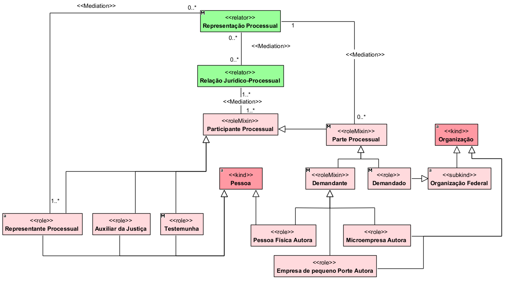

## Diagrama de sujeitos e papéis

  
### Dicionario de termos

| Conceito                            | Definição                                                                          |
| ----------------------------------- | ---------------------------------------------------------------------------------- |
| **Pessoa**                          | Indivíduo que pode exercer diferentes papéis no processo.                          |
| **Organização**                     | Entidade organizada que pode participar de relações jurídicas.                     |
| **Organização Federal**             | Organização pertencente à esfera federal.                                          |
| **Participante Processual**         | Sujeito que participa do processo exercendo algum papel processual.                |
| **Parte Processual**                | Participante que ocupa um dos polos da relação processual.                         |
| **Autor**                           | Parte que apresenta a demanda ao Poder Judiciário.                                 |
| **Pessoa Física Autora**            | Pessoa física que ocupa o papel de autora no processo.                             |
| **Microempresa Autora**             | Microempresa que ocupa o papel de autora no processo.                              |
| **Empresa de Pequeno Porte Autora** | Empresa de pequeno porte que ocupa o papel de autora no processo.                  |
| **Réu Federal**                     | Parte federal contra a qual a ação é proposta.                                     |
| **Autarquia Federal**               | Entidade da Administração Pública Federal indireta que pode figurar como ré.       |
| **Fundação Pública Federal**        | Fundação pública federal que pode figurar como ré.                                 |
| **Empresa Pública Federal**         | Empresa pública federal que pode figurar como ré.                                  |
| **União Federal**                   | Ente federal que pode ocupar o polo passivo da ação.                               |
| **Representante Processual**        | Sujeito que representa juridicamente uma das partes no processo.                   |
| **Advogado Constituído**            | Advogado escolhido pela parte para representá-la no processo.                      |
| **Defensor Público**                | Agente público que presta assistência e representação jurídica à parte.            |
| **Procurador Federal**              | Agente responsável pela representação judicial de entidade federal.                |
| **Representação Processual**        | Relação que vincula uma parte ao seu representante no processo.                    |
| **Auxiliar da Justiça**             | Participante que auxilia o órgão julgador na realização de atividades processuais. |
| **Perito**                          | Profissional que fornece conhecimento técnico ou científico ao processo.           |
| **Conciliador**                     | Participante que auxilia as partes na tentativa de acordo.                         |
| **Testemunha**                      | Pessoa que presta depoimento sobre fatos relevantes para o processo.               |
| **Órgão Julgador**                  | Órgão responsável por processar e julgar a ação.                                   |
| **Juiz**                            | Pessoa responsável pela condução e decisão do processo.                            |
| **Relação Jurídico-Processual**     | Relação que vincula autor, réu e órgão julgador no processo.                       |
