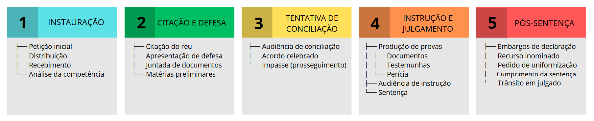

# Contexto

## 1. Contexto Legal e Institucional

### 1.1 Conceito Fundamental

O **Juizado Especial Federal Cível** é um órgão da Justiça Federal destinado à solução de conflitos de menor complexidade envolvendo causas de competência federal, com procedimento simplificado, maior celeridade e amplo acesso à justiça.

Criado pela **Lei nº 10.259/2001**, representa um microssistema processual próprio, aplicado às demandas cíveis federais de pequeno valor, especialmente aquelas propostas por cidadãos, microempresas e empresas de pequeno porte contra a União, autarquias federais, fundações públicas federais e empresas públicas federais.

O Juizado Especial Federal Cível busca garantir uma prestação jurisdicional mais simples, rápida, econômica e acessível, priorizando a conciliação e a solução efetiva do conflito.

### 1.2 Princípios Fundadores

1. **Oralidade** - Primazia da comunicação simples e direta entre as partes e o juízo.
2. **Simplicidade** - Redução da complexidade formal do processo.
3. **Informalidade** - Flexibilização das formas processuais.
4. **Celeridade** - Rapidez na tramitação e solução da demanda.
5. **Economia processual** - Redução de atos desnecessários e de custos processuais.
6. **Acesso à justiça** - Facilitação do ingresso do cidadão no Poder Judiciário.
7. **Conciliação** - Estímulo à composição amigável entre as partes.

### 1.3 Marcos Legais Principais

* **Constituição Federal de 1988** - Previsão dos Juizados Especiais no art. 98, I.
* **Lei nº 10.259/2001** - Lei dos Juizados Especiais Federais.
* **Lei nº 9.099/1995** - Aplicação subsidiária aos Juizados Especiais Federais, quando compatível.
* **Código de Processo Civil de 2015** - Aplicação subsidiária, quando compatível com o rito dos Juizados.
* **Lei nº 11.419/2006** - Informatização do processo judicial.
* **Normas dos Tribunais Regionais Federais** - Regulamentam aspectos práticos do funcionamento dos Juizados Federais.

---

## 2. Estrutura Organizacional

### 2.1 Sujeitos Processuais

#### **Partes (Sujeitos Interessados no Resultado)**

* **Autor** - Quem inicia a ação perante o Juizado Especial Federal.
* **Réu** - Ente ou entidade federal contra quem se dirige a ação.
* **Litisconsorte** - Pessoa ou entidade que participa do processo em conjunto com uma das partes.
* **Terceiro** - Participação eventual, quando admitida e compatível com o rito.

#### **Possíveis Autores**

No Juizado Especial Federal Cível, podem propor ação:

* Pessoa física;
* Microempresa;
* Empresa de pequeno porte.

#### **Possíveis Réus**

No polo passivo, podem figurar:

* União;
* Autarquias federais, como o INSS;
* Fundações públicas federais;
* Empresas públicas federais, como a Caixa Econômica Federal.

#### **Entes Judiciários**

* **Juiz Federal** - Magistrado responsável pela condução e decisão do processo.
* **Juizado Especial Federal Cível** - Órgão de primeiro grau responsável por conciliar, processar e julgar a causa.
* **Turma Recursal** - Órgão responsável por julgar recursos contra sentenças do Juizado Especial Federal.
* **Turma Regional de Uniformização** - Órgão que pode atuar em casos de divergência regional sobre interpretação de lei federal.
* **Turma Nacional de Uniformização** - Órgão que pode atuar em casos de divergência nacional sobre interpretação de lei federal.

#### **Auxiliares**

* **Conciliador** - Auxilia na tentativa de acordo entre as partes.
* **Servidor Judicial** - Atua na prática dos atos de secretaria e movimentação processual.
* **Oficial de Justiça** - Cumpre mandados e diligências, quando necessário.
* **Perito** - Realiza perícia técnica, como perícia médica, social ou contábil simples.
* **Testemunha** - Pessoa que presta depoimento sobre fatos relevantes.
* **Advogado** - Representa tecnicamente a parte, sendo indispensável na fase recursal.

### 2.2 Competência e Jurisdição

#### Exemplos **não exaustivo** de ações comuns:

#### **Competência Ratione Materiae (Por Matéria)**

1. **Ações previdenciárias**

   * Concessão de aposentadoria;
   * Concessão de auxílio por incapacidade temporária;
   * Concessão de aposentadoria por incapacidade permanente;
   * Concessão de auxílio-acidente;
   * Concessão de pensão por morte;
   * Concessão de salário-maternidade;
   * Revisão de benefício previdenciário;
   * Restabelecimento de benefício previdenciário.

2. **Ações assistenciais**

   * Concessão de Benefício de Prestação Continuada;
   * Restabelecimento de BPC;
   * Revisão de benefício assistencial.

3. **Ações contra a Caixa Econômica Federal**

   * Questões relacionadas ao FGTS;
   * Contratos habitacionais;
   * Questões bancárias de competência federal.

4. **Ações contra a União**

   * Questões administrativas federais;
   * Responsabilidade civil da União;
   * Servidores públicos federais, quando a matéria for compatível com o JEF.

5. **Ações contra autarquias e fundações federais**

   * Questões administrativas;
   * Benefícios;
   * Obrigações de fazer;
   * Cobranças de pequeno valor.

#### **Competência Ratione Valor (Por Valor)**

* O Juizado Especial Federal Cível julga causas de competência da Justiça Federal cujo valor não ultrapasse **60 salários mínimos**.

#### **Competência Ratione Personae (Por Pessoa)**

A competência do Juizado Especial Federal está relacionada à presença de ente ou entidade federal no processo.

Em regra, o réu será:

* União;
* Autarquia federal;
* Fundação pública federal;
* Empresa pública federal.

#### **Competência Territorial**

* Juizado competente conforme a subseção judiciária;
* Domicílio do autor, quando aplicável;
* Local do fato;
* Local de cumprimento da obrigação;
* Regras específicas da Justiça Federal.

#### **Exclusões (Não Cabe Juizado Especial Federal)**

* Mandado de segurança;
* Ações de desapropriação;
* Ações de divisão e demarcação;
* Ações populares;
* Execuções fiscais;
* Ações de improbidade administrativa;
* Demandas sobre direitos ou interesses difusos, coletivos ou individuais homogêneos;
* Causas sobre bens imóveis da União, autarquias e fundações públicas federais;
* Causas que exijam prova complexa incompatível com o rito dos Juizados;
* Demandas com valor superior a 60 salários mínimos, salvo renúncia ao excedente.

---

## 3. O Processo (Macro-Estrutura)

### 3.1 Definição

Um **Processo no Juizado Especial Federal Cível** é o conjunto de atos praticados pelas partes, pelo órgão judicial e pelos auxiliares da justiça, ordenados conforme a lei, com o objetivo de resolver conflito de competência federal de pequeno valor e menor complexidade.

O processo no JEF busca solucionar a demanda de forma simples, célere e efetiva, evitando formalidades excessivas e priorizando a conciliação.

### 3.2 Fases Principais do Processo

---

## 4. Procedimento (Como o Processo Funciona)

### 4.1 Procedimento no Juizado Especial Federal Cível

#### **Etapa 1: Instauração**

* O processo começa com a apresentação da petição inicial pelo autor
* A petição pode ser escrita ou, em alguns casos, oral e reduzida a termo
* Deve conter a identificação das partes
* Deve descrever os fatos e o fundamento do direito
* Deve indicar o pedido e o valor da causa
* Deve ser acompanhada dos documentos necessários

**Atos Processuais:**

* `Distribuição` - O processo é encaminhado ao Juizado competente
* `Autuação` - Criação do número do processo
* `Análise Inicial` - Verificação da competência, do valor da causa e dos documentos
* `Recebimento` - O juiz recebe a petição inicial, se estiver adequada

**Possíveis Desfechos:**

* Petição inicial recebida → Prosseguimento do processo
* Necessidade de correção → Autor é intimado para emendar a inicial
* Incompetência do Juizado → Processo não segue no JEF
* Indeferimento da inicial → Processo é encerrado sem análise do mérito

---

#### **Etapa 2: Citação e Defesa**

* O réu é comunicado da existência do processo
* No JEF Cível, o réu geralmente é um órgão ou entidade federal
* O réu pode apresentar defesa contra o pedido do autor
* A entidade pública deve juntar os documentos que possui sobre o caso
* Pode haver apresentação de proposta de acordo

**Atos Processuais:**

* `Citação` - Comunicação formal ao réu
* `Contestação` - Defesa apresentada pelo réu
* `Juntada de Documentos` - Apresentação de documentos administrativos
* `Proposta de Acordo` - Possibilidade de solução consensual

**Conceitos:**

* `Contestação` - Resposta do réu contra o pedido do autor
* `Revelia` - Ausência de defesa, quando aplicável
* `Preliminares` - Questões processuais analisadas antes do mérito
* `Processo Administrativo` - Documentos produzidos pelo órgão público antes da ação judicial

---

#### **Etapa 3: Tentativa de Conciliação**

* As partes podem tentar resolver o conflito por acordo
* A conciliação pode ocorrer em audiência ou por proposta apresentada no processo
* Se houver acordo, ele será homologado pelo juiz
* Se não houver acordo, o processo continua

**Atos Processuais:**

* `Intimação das Partes` - Comunicação para participação no ato
* `Audiência de Conciliação` - Tentativa de acordo conduzida pelo Juizado
* `Proposta de Acordo` - Oferta feita por uma das partes
* `Homologação` - Confirmação judicial do acordo

**Possíveis Desfechos:**

* Acordo celebrado → Sentença homologatória
* Acordo recusado → Prosseguimento do processo
* Ausência de proposta → Processo segue para instrução ou julgamento

---

#### **Etapa 4: Instrução e Julgamento**

* Se não houver acordo, o juiz analisa as provas
* A fase de instrução serve para esclarecer os fatos
* Pode haver produção de prova documental, testemunhal ou pericial
* Após a análise das provas, o juiz profere sentença

**Produção de Provas:**

* Documentos
* Processo administrativo
* Testemunhas
* Laudos médicos
* Exames
* Perícia médica, social ou técnica

**Atos Processuais:**

* `Análise das Provas` - Verificação dos documentos e informações juntadas
* `Perícia` - Exame técnico realizado por profissional nomeado pelo juiz
* `Laudo Pericial` - Documento com a conclusão do perito
* `Manifestação das Partes` - Autor e réu podem se manifestar sobre as provas
* `Sentença` - Decisão do juiz sobre o pedido

**Possíveis Desfechos:**

* Pedido procedente → Autor ganha a ação
* Pedido parcialmente procedente → Autor ganha apenas parte do pedido
* Pedido improcedente → Autor perde a ação
* Extinção do processo → Processo é encerrado sem análise do mérito
* Homologação de acordo → Acordo passa a valer como decisão judicial

---

#### **Etapa 5: Pós-Sentença**

* Após a sentença, as partes podem aceitar a decisão ou recorrer
* O principal recurso no JEF Cível é o recurso inominado
* O recurso é julgado pela Turma Recursal
* Depois que não houver mais recurso, ocorre o trânsito em julgado
* Em seguida, inicia-se o cumprimento da sentença

**Atos Processuais:**

* `Intimação da Sentença` - Comunicação da decisão às partes
* `Embargos de Declaração` - Pedido para corrigir omissão, contradição ou erro
* `Recurso Inominado` - Recurso contra a sentença
* `Turma Recursal` - Órgão que julga o recurso
* `Trânsito em Julgado` - Momento em que não cabe mais recurso
* `Cumprimento da Sentença` - Fase em que a decisão é efetivada

**Conceitos:**

* `Sentença` - Decisão que resolve a causa
* `Recurso Inominado` - Recurso próprio do Juizado contra a sentença
* `Obrigação de Fazer` - Determinação para que o réu realize uma providência
* `Arquivamento` - Encerramento do processo após o cumprimento da decisão

**Possíveis Desfechos:**

* Sentença mantida → Decisão continua como foi proferida
* Sentença reformada → Decisão é modificada pela Turma Recursal
* Implantação ou revisão de benefício → Cumprimento de obrigação de fazer
* Confirmação do direito → Comprimento da obrigação por parte do réu
* Cumprimento integral → Processo é arquivado

---

## 5. Atos Processuais

### 5.1 Classificação por Responsável

#### **Atos do Juiz**

* Despacho;
* Decisão interlocutória;
* Tutela provisória;
* Sentença;
* Homologação de acordo;
* Determinação de perícia;
* Requisição de documentos;
* Requisição de direito;

#### **Atos das Partes**

* Petição inicial;
* Contestação;
* Manifestação;
* Juntada de documentos;
* Proposta de acordo;
* Aceitação ou recusa de acordo;
* Recurso inominado;
* Embargos de declaração;
* Contrarrazões.

#### **Atos dos Serventuários**

* Autuação;
* Citação;
* Intimação;
* Certidão;
* Expedição de mandado;
* Expedição de requisição;
* Movimentação processual;
* Comunicação eletrônica dos atos.

#### **Atos dos Auxiliares**

* Conciliação;
* Perícia;
* Elaboração de laudo;
* Depoimento testemunhal;
* Cumprimento de diligência;
* Prestação de informações técnicas.

### 5.2 Conceitos Fundamentais

| Ato                          | Conceito                                                          |
| ---------------------------- | ----------------------------------------------------------------- |
| **Petição Inicial**          | Requerimento que inicia o processo                                |
| **Citação**                  | Comunicação formal ao réu sobre a existência da ação              |
| **Intimação**                | Comunicação processual para ciência ou prática de ato             |
| **Contestação**              | Resposta do réu aos fundamentos da ação                           |
| **Conciliação**              | Tentativa de acordo entre as partes                               |
| **Perícia**                  | Prova técnica realizada por profissional especializado            |
| **Laudo Pericial**           | Documento produzido pelo perito                                   |
| **Sentença**                 | Decisão que resolve a causa                                       |
| **Acordo**                   | Composição amigável entre as partes                               |
| **Revelia**                  | Ausência de resposta do réu                                       |
| **Cumprimento de Sentença**  | Fase de efetivação da decisão                                     |
| **Confirmação do direito**   | Cumprimento de obrigação requisitada                              |

---

## 6. Recursos

### 6.1 Tipos de Recursos Disponíveis

#### **Embargos de Declaração**

* Utilizados para esclarecer obscuridade, contradição, omissão ou erro material.
* Podem ser opostos contra sentença ou acórdão.
* Não servem, em regra, para rediscutir o mérito.

#### **Recurso Inominado**

* Recurso cabível contra sentença.
* Julgado pela Turma Recursal.
* Exige representação por advogado.
* Busca o reexame da decisão de primeiro grau.

#### **Pedido de Uniformização**

* Utilizado quando houver divergência de interpretação de lei federal.
* Pode ser dirigido à Turma Regional de Uniformização ou à Turma Nacional de Uniformização.
* É voltado à uniformização da jurisprudência no sistema dos Juizados Federais.

#### **Recurso Extraordinário**

* Cabível excepcionalmente quando houver questão constitucional.
* Dirigido ao Supremo Tribunal Federal.
* Depende do preenchimento dos requisitos constitucionais e processuais.

### 6.2 Características dos Recursos no Juizado

* Simplificados;
* Mais restritos que no procedimento comum;
* Voltados ao controle da sentença;
* Julgados por Turma Recursal;
* Exigem advogado na fase recursal;
* Não há reexame necessário;
* Podem gerar uniformização de entendimento em matéria federal.

---

## 7. Conceitos Adjacentes

### 7.1 Litígio

Conflito de interesses entre o autor e o ente ou entidade federal ré, submetido ao Juizado Especial Federal.

### 7.2 Causa de Pedir

Fatos e fundamentos jurídicos que justificam o pedido formulado pelo autor.

### 7.3 Pedido

O que o autor pretende obter com a ação, como concessão de benefício, revisão, restabelecimento, pagamento de atrasados ou cumprimento de obrigação.

### 7.4 Valor da Causa

Importância econômica atribuída à demanda, limitada, em regra, a 60 salários mínimos no Juizado Especial Federal.

### 7.5 Competência Federal

Critério que define se a causa pertence à Justiça Federal, geralmente pela presença da União, autarquia federal, fundação pública federal ou empresa pública federal.

### 7.6 Interesse de Agir

Necessidade e utilidade do processo judicial, normalmente demonstradas por indeferimento administrativo, demora excessiva, resistência da Administração ou lesão a direito.

### 7.7 Prescrição

Perda da pretensão de exigir judicialmente determinado direito ou parcela em razão do decurso do tempo.

### 7.8 Decadência

Perda do direito de revisar, modificar ou constituir determinada situação jurídica pelo decurso do prazo legal.

### 7.9 Preclusão

Perda do direito de praticar determinado ato processual por não ter sido realizado no momento adequado.

### 7.10 Trânsito em Julgado

Momento em que a decisão judicial não pode mais ser modificada por recurso ordinário.

---

## 8. Interação entre Conceitos (Visão Integrada)

Uma **AÇÃO FEDERAL** é instaurada por meio de um **PROCESSO NO JUIZADO ESPECIAL FEDERAL**.

O **PROCESSO** é composto por múltiplos **ATOS PROCESSUAIS**.

As **PARTES** participam do processo como **AUTOR** e **RÉU FEDERAL**.

O **AUTOR** pode ser pessoa física, microempresa ou empresa de pequeno porte.

O **RÉU FEDERAL** pode ser a União, o INSS, a Caixa Econômica Federal, uma autarquia ou uma fundação pública federal.

O **JUIZ FEDERAL** conduz o processo conforme o procedimento simplificado.

O **JUIZADO** analisa a competência, o valor da causa e os requisitos da petição inicial.

O **RÉU** é citado ou convocado para apresentar defesa e, quando possível, participar de tentativa de conciliação.

Durante o procedimento, pode haver **CONCILIAÇÃO**.

Se houver acordo, o juiz profere **SENTENÇA HOMOLOGATÓRIA**.

Se não houver acordo, o processo segue para **CONTESTAÇÃO**.

Após a contestação, podem ser produzidas **PROVAS**.

Quando necessário, pode ser realizada **PERÍCIA**.

Encerrada a instrução, o juiz profere **SENTENÇA**.

A **SENTENÇA** pode ser impugnada por **RECURSO INOMINADO**.

O **RECURSO INOMINADO** é julgado pela **TURMA RECURSAL**.

Após o trânsito em julgado, inicia-se o **CUMPRIMENTO DA SENTENÇA**.

O cumprimento pode resultar em **CONFIRMAÇÃO DO DIREITO**.
