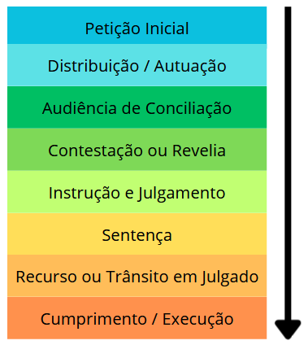
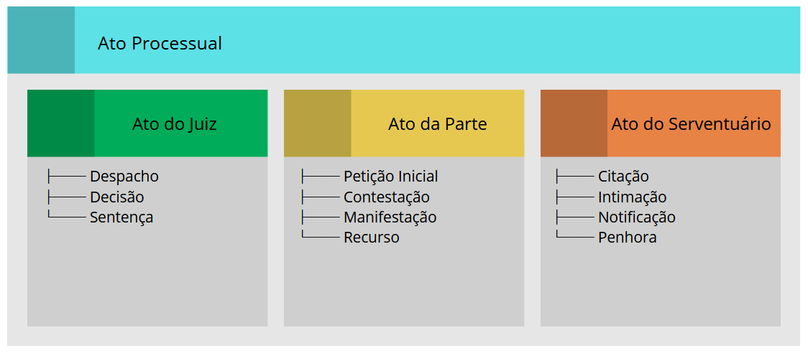
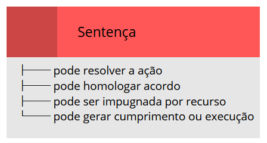
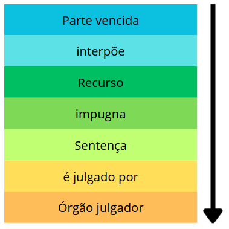

# Ontologia do Juizado Especial Cível

## Resumo

A ontologia a ser construída tem como objetivo representar, de forma conceitual e estruturada, o domínio do Juizado Especial Cível, identificando seus principais sujeitos, atos, documentos, fases procedimentais, decisões e efeitos jurídicos.

A proposta parte da modelagem das entidades centrais do processo judicial, seus atributos relevantes e os relacionamentos jurídicos e processuais que conectam esses elementos. A ontologia permitirá compreender como uma ação é proposta, como se transforma em processo, quais sujeitos participam, quais atos são praticados, quais fases compõem o procedimento e quais resultados podem surgir, como acordo, sentença, recurso ou execução.

## 1. Escopo da ontologia

A ontologia será voltada ao funcionamento básico do Juizado Especial Cível, contemplando principalmente:

- estrutura do processo;
- tipos de ação;
- sujeitos processuais;
- papéis exercidos pelas partes;
- procedimento e suas fases;
- atos processuais;
- audiência de conciliação;
- sentença;
- recursos;
- acordo;
- regras básicas de competência, tramitação e encerramento processual.

O foco não será representar todo o Direito Processual Civil, mas sim um recorte específico: o caminho típico de uma demanda no Juizado Especial Cível, desde a propositura da ação até a sua solução.

## 2. Entidades que serão construídas

A ontologia será formada por entidades principais, que representam os conceitos fundamentais do domínio.

### 2.1 Processo

O Processo será uma entidade central da ontologia. Ele representará a estrutura jurídica em que os atos processuais são praticados para solucionar uma lide.

**Atributos:**
- número do processo;
- data de abertura;
- data de distribuição;
- valor da causa;
- matéria discutida;
- status processual;
- data de encerramento.

**Relacionamentos:**
O Processo se relacionará com a Ação, as Partes, o Juiz, o Procedimento, os Atos Processuais e, eventualmente, com a Sentença, o Recurso e o Acordo.

### 2.2 Ação

A Ação representará a pretensão levada ao Juizado. Ela indicará o tipo de conflito submetido ao Poder Judiciário.

**Tipos de ação:**
- ação de cobrança;
- ação de indenização;
- ação possessória;
- ação de rescisão contratual;
- ação de despejo;
- ação de divisão;
- ação de nulidade;
- ação decorrente de relação de consumo.

**Atributos principais:**
- tipo da ação;
- descrição;
- causa de pedir;
- pedido;
- data de interposição;
- grau de complexidade.

### 2.3 Parte

A entidade Parte representará a pessoa física ou jurídica que participa do processo com interesse jurídico no resultado.

**Papéis processuais:**
- Autor;
- Réu;
- Litisconsorte;
- Terceiro.

**Atributos:**
- nome;
- CPF ou CNPJ;
- endereço;
- tipo de pessoa;
- contato;
- papel exercido no processo.

### 2.4 Sujeitos processuais

A ontologia também representará os sujeitos que atuam no processo:

- **Juiz**: conduz o processo e profere sentença;
- **Advogado**: representa a Parte;
- **Conciliador**: atua na tentativa de acordo;
- **Serventuário**: executa atos de cartório;
- **Oficial de Justiça**: realiza diligências externas;
- **Perito**: produz prova técnica quando necessário;
- **Testemunha**: fornece prova testemunhal.

### 2.5 Procedimento e Fase

O Procedimento representará a marcha processual, ou seja, a sequência lógica de atos que organizam o processo.

**Fases do procedimento:**
- instauração;
- conciliação;
- defesa ou contestação;
- instrução e julgamento;
- sentença;
- fase pós-sentença;
- execução ou cumprimento.

**Atributos de cada fase:**
- nome;
- ordem;
- descrição;
- prazo padrão.

### 2.6 Ato Processual

O Ato Processual representará cada manifestação ou providência praticada dentro do processo.

**Especialidades:**

- **Atos do juiz**: despacho, decisão, sentença;
- **Atos das partes**: petição, contestação, manifestação, recurso;
- **Atos dos serventuários**: citação, intimação, notificação, penhora.

**Atributos principais:**
- tipo do ato;
- data;
- responsável;
- descrição;
- efeitos jurídicos.

### 2.7 Sentença

A Sentença será modelada como a decisão que resolve ou encerra a demanda.

**Componentes:**
- texto da decisão;
- data;
- fundamentação;
- resultado;
- procedência, improcedência ou procedência parcial;
- informação sobre trânsito em julgado.

**Relacionamentos:**
A Sentença poderá estar relacionada a um Recurso ou ao início da fase de execução.

### 2.8 Recurso

O Recurso representará o meio de impugnação da decisão judicial.

**Tipos de recurso:**
- apelação;
- embargos à execução;
- reclamação;
- recurso extraordinário (em hipóteses excepcionais).

**Atributos:**
- tipo;
- data de interposição;
- fundamentação;
- status;
- decisão recorrida;
- órgão julgador.

### 2.9 Acordo e Conciliação

A **Conciliação** será representada como ato ou fase voltada à tentativa de solução consensual do conflito.

O **Acordo** será o resultado possível da conciliação, celebrado pelas partes e, quando homologado pelo juiz, apto a encerrar a demanda.

**Componentes do Acordo:**
- data;
- condições;
- partes envolvidas;
- informação sobre homologação;
- consequências processuais.

## 3. Visões da ontologia

Para facilitar a construção e a compreensão do modelo, a ontologia pode ser organizada em diferentes visões.

### 3.1 Visão estrutural

A visão estrutural mostrará as principais classes da ontologia e suas relações estáticas.

**Entidades representadas:**
- Processo;
- Ação;
- Parte;
- Juiz;
- Advogado;
- Procedimento;
- Fase;
- Ato Processual;
- Sentença;
- Recurso;
- Acordo.

**Pergunta respondida:** Quais são os principais elementos existentes no domínio do Juizado Especial Cível?

**Exemplo de leitura:**
Um Processo instancia uma Ação, envolve Partes, é conduzido por um Juiz, segue um Procedimento, é composto por Atos Processuais e pode resultar em Sentença, Acordo ou Recurso.

### 3.2 Visão dos sujeitos e papéis processuais

Essa visão destacará quem participa do processo e qual função cada sujeito exerce.

**Papéis da Parte:**
- Autor;
- Réu;
- Litisconsorte;
- Terceiro.

**Outros sujeitos:**
- Juiz;
- Advogado;
- Conciliador;
- Perito;
- Testemunha;
- Oficial de Justiça.

**Importância:** Uma mesma pessoa pode existir fora do processo, mas assumir um papel específico dentro dele. Por exemplo, uma pessoa física pode assumir o papel de Autor em um processo e de Réu em outro.

### 3.3 Visão procedimental

A visão procedimental representará a sequência de fases do Juizado Especial Cível.

**Estrutura básica:**

**Pergunta respondida:** Como o processo se desenvolve no tempo?

**Utilidade:** Representar a ordem dos atos processuais e as dependências entre as fases.

### 3.4 Visão dos atos processuais

Essa visão detalhará os atos praticados durante o processo e seus responsáveis.

**Classificação dos atos:**

**Utilidade:** Identificar quem pratica cada ato, em qual fase ele ocorre e quais efeitos jurídicos produz.

### 3.5 Visão decisória

A visão decisória representará os possíveis resultados do processo.

**Formas de encerramento:**
- acordo homologado;
- sentença de procedência;
- sentença de improcedência;
- sentença de procedência parcial;
- extinção sem resolução do mérito;
- cumprimento da obrigação;
- arquivamento.

**Exemplo:**

### 3.6 Visão recursal

A visão recursal representará os meios de impugnação das decisões.

Nessa visão, o Recurso será associado à decisão impugnada e ao sujeito que o interpõe.

**Exemplo:**

**Importância:** Demonstra que a sentença não encerra necessariamente o processo, pois pode abrir uma nova etapa de reanálise.

### 3.7 Visão de regras e restrições

A ontologia também deverá conter regras de integridade e restrições conceituais.

**Regras relevantes:**

- todo Processo deve ter pelo menos um Autor e um Réu;
- uma Ação deve estar associada a um Processo;
- uma Parte pode ou não estar assistida por Advogado;
- uma Sentença deve ser proferida por um Juiz;
- um Recurso deve impugnar uma decisão;
- um Acordo deve envolver ao menos duas Partes;
- a Conciliação deve ocorrer antes da fase de julgamento, salvo exceções;
- a Sentença pode ou não transitar em julgado;
- o Processo deve respeitar os limites de competência do Juizado.
